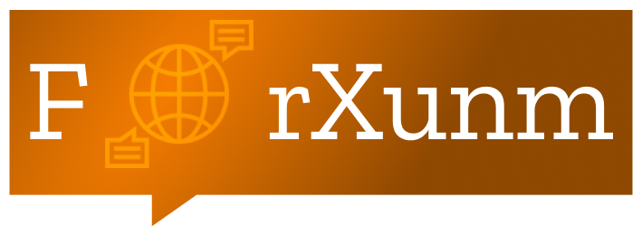

  

**Forxunm** adalah platform **forum komunikasi real-time** yang memungkinkan pengguna untuk berinteraksi secara langsung dengan aman. Dengan menggabungkan teknologi canggih untuk enkripsi data menggunakan **AES** (Advanced Encryption Standard) dan **RSA** (Rivest-Shamir-Adleman), Forxunm memastikan bahwa percakapan dan data pengguna terlindungi dengan baik.

---

## 🚀 **Fitur Utama**
- **💬 Forum Diskusi Real-Time**  
  Forum yang memungkinkan pengguna berdiskusi dan berbagi informasi secara langsung tanpa penundaan.
- **🔐 Keamanan AES & RSA**  
  Semua data yang dikirimkan melalui platform ini dienkripsi menggunakan standar **AES** untuk melindungi informasi sensitif, dan **RSA** digunakan untuk keamanan pertukaran kunci.
- **🔔 Tread**  
  Pengguna dapat bergabung kedalam tread atau diskusi secara Real-Time.
- **👤 Pengelolaan Profil**  
  Sesuaikan profil kamu dengan gambar, status, dan nama pengguna.

---

## 🔒 **Keamanan**
- **Enkripsi Hybrid (AES + RSA)**  
  Sistem menggunakan kombinasi AES dan RSA untuk menjaga kerahasiaan dan integritas data. AES digunakan untuk mengenkripsi isi pesan dan data percakapan, sementara RSA digunakan untuk mengenkripsi pertukaran kunci antara server dan pengguna. Pendekatan ini memastikan bahwa hanya pihak yang berwenang yang dapat mengakses dan membaca data sensitif.
  
- **Perlindungan dari Serangan Umum**  
  Sistem telah diperkuat untuk menangkal berbagai jenis serangan seperti Cross-Site Scripting (XSS), Cross-Site Request Forgery (CSRF), File Upload Vulnerability, SQL Injection, Command Injection, dan Brute Force Attack. Melalui validasi input yang ketat, pembatasan akses, serta pemantauan keamanan aktif, data pengguna tetap aman dan terlindungi.
---

## 💻 **Teknologi yang Digunakan**
- **JavaScript & Node.js**  
  Platform ini dibangun menggunakan JavaScript untuk front-end dan Node.js untuk back-end.
- **MySQL**  
  Digunakan untuk autentikasi dan manajemen database pengguna secara real-time.
- **AES & RSA**  
  Sistem enkripsi untuk menjaga keamanan data pengguna dan komunikasi di dalam forum.
- **Bootstrap CSS**  
  Untuk membuat tampilan lebih interaktif dan lebih kece.
- **JWT (JSON Web Token)**
  Manajemen sesi dan autentikasi pengguna secara aman dan efisien.
- **Google reCAPTCHA**
  untuk mencegah aktivitas bot dan serangan brute force dengan verifikasi pengguna secara cerdas.

---

## 🌟 **Panduan Penggunaan**
1. **Daftar dan Login**  
   Registrasi menggunakan username
2. **Bergabung dengan Forum**  
   Pilih forum yang ingin kamu ikuti, atau buat forum baru untuk topik tertentu.
3. **Mengirim Pesan**  
   Mulai diskusi dan kirimkan pesan yang aman dengan enkripsi **AES**.
4. **Atur Pengguna**  
   Kelola akun, Mulai dari email dan bio dan foto profile.

---

## 🛠️ **To-Do List**
- [ ] Menyusun struktur forum dan sistem kategori
- [ ] Sistem notifikasi push
- [ ] Menambahkan pengaturan privasi dan kontrol akses
- [ ] Menyempurnakan UI/UX untuk kenyamanan pengguna

---

## 🎯 **Visi**
Dengan **Forxunm**, Saya ingin memberikan File proyek saya bisa membuat tempat untuk berdiskusi tetapi juga menjaga keamanan data pengguna dengan menggunakan teknologi enkripsi terbaik. Forum ini bertujuan untuk memberi ruang bagi percakapan yang lebih aman dan efisien.

---

💡 **Kontribusi**  
Saya terbuka untuk kontribusi! Silakan fork repository ini, kirimkan PR, atau beri masukan fitur baru.